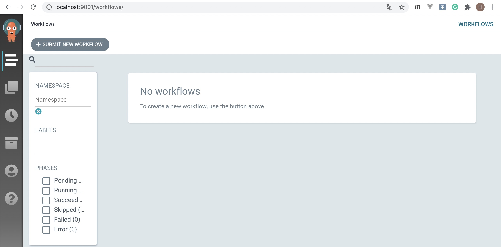
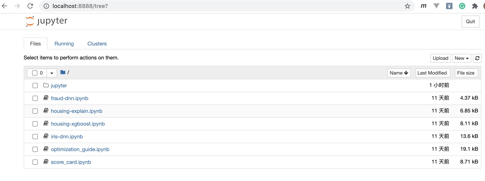
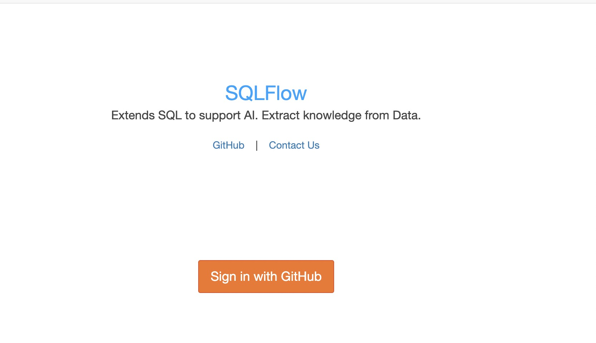

# 在 Kubernetes 中安装 SQLFlow

本文将介绍如何在 Kubernetes 中安装 SQLFlow，你有两种模式可以选择：

* 单人模式：主要针对单个用户，例如在个人电脑上安装。我们采用了相对简化的安装方法，
    例如省去了用户登录校验等。
* 多人模式：主要针对多个用户共享一个 SQLFlow server 的场景，我们增加了用户登录
    校验，支持 HTTPS 服务等来确保安全性。

本文假设使用者已经了解 Kubernetes、Docker 等概念，如果需要对相关知识进行回顾，
或是希望对 SQLFlow 的运行原理做比较深入的了解，可以参考这篇[文档](develop_tutorial.cn.md),
以及这篇[文章](https://zhuanlan.zhihu.com/p/258104727)。

## Kubernetes 集群搭建

### 安装 MiniKube

无论选择哪种模式，都需要先搭建一个 Kubernetes 集群，这里我们选择 MiniKube 来快速搭建
这个集群。你可以参考 [MiniKube 官方文档](https://minikube.sigs.k8s.io/docs/start/)来进行安装，下文以 Linux 环境为例进行介绍。

```
wget https://storage.googleapis.com/kubernetes-release/release/v1.18.2/bin/linux/amd64/kubectl
sudo mv kubectl /usr/local/bin/kubectl

wget https://storage.googleapis.com/minikube/releases/v1.10.1/minikube-linux-amd64
sudo mv minikube-linux-amd64 /usr/local/bin/minikube
```

### 启动 MiniKube 集群
以下命令将在本地启动一个 MiniKube 集群，注意需要以 root 账号来启动。

```bash
minikube start --image-mirror-country cn \
  --registry-mirror=https://registry.docker-cn.com \
  --driver=none \
  --kubernetes-version=v1.18.2
```

集群初始化完成之后，我们可以用如下命令来查看其运行状态， 系统应该回显集群正在运行中：

```bash
> minikube status

minikube
type: Control Plane
host: Running
kubelet: Running
apiserver: Running
kubeconfig: Configured
```

我们还可以用刚刚安装的 `kubectl` 工具来查看集群的一些细节，例如查看集群中有哪些 namespace。
```
> kubectl get ns

NAME                   STATUS   AGE
default                Active   0d
```

### 安装 Argo

[Argo](https://argoproj.github.io/projects/argo/) 是一个工作流引擎，它可以帮助 SQLFlow进行工作流提交，任务监控，
日志展示等工作。我们可以通过以下命令在集群中启动 Argo 。
```
kubectl create namespace argo

kubectl create rolebinding default-admin --clusterrole=admin --serviceaccount=default:default

kubectl apply -n argo -f http://cdn.sqlflow.tech/argo-v2.7.7.yaml
```

我们通过另一个 `kubectl` 命令来查看 Argo 的运行情况，并等待其启动完成。注意运行 Argo 会拉取其
Docker 镜像，因此可能需要等待几分钟才能完成。
```
> kubectl get pods -nargo --watch

NAME                                   READY   STATUS    RESTARTS   AGE
argo-server-7f4dffc6db-784nb           1/1     Running   0          0d
workflow-controller-59d4b5cb75-tf85k   1/1     Running   0          0d
```
当状态变为 `Running` 时，表明 Argo 已经启动完成。此时，我们可以查看其自带的管理界面。首先运行下面的命令将其服务暴露在本机 `9001` 端口，然后在浏览器中打开 `http://127.0.0.1:9001`。
```
nohup kubectl -n argo port-forward deployment/argo-server 9001:2746 --address=0.0.0.0 &
```
你应该可以在浏览器中看到如下页面：


## 单人模式的安装

我们采用安装 Argo 类似的方式安装 SQLFlow，即运行 `kubectl` 命令向集群提交配置文件，等待集群拉取镜像，然后启动服务。

1. 提交部署配置
```bash
kubectl apply -f http://cdn.sqlflow.tech/playground/install-sqlflow.yaml
```

1. 等待集群部署完成，当 `sqlflow-server` 状态变为 `Running` 时，系统即已部署好。
```
> kubectl get pods --watch

NAME             READY   STATUS    RESTARTS   AGE
sqlflow-server   4/4     Running   0          0d
```

到此，单人模式已经安装完毕。我们可以尝试访问 SQFLow 的 web UI。同样地，我们将 SQLFlow 的服务
端口暴露出来，然后在浏览器中进行访问 `http://localhost:8888`。

```
nohup kubectl port-forward pod/sqlflow-server 8888:8888 --address=0.0.0.0 &
```
你将会看到如下界面，此时我们可以选择其中的例子来运行：


## 多人模式的安装

此模式适合多人共享一套 SQLFlow 服务，我们提供了 JupyterHub 来作为用户界面，它可以为每个用户启动一个
独立的运行环境，可以达到多个人同时体验 SQLFlow 的目的，也可以作为线上集群运行环境搭建的原型。因为需要同
时服务多个用户，我们提供了账号校验等功能。我们可以按照如下步骤来进行安装：

1. 下载部署配置
```
wget http://cdn.sqlflow.tech/playground/install-sqlflow-multi-users.yaml
```

1. 准备 `HTTPS` 相关配置。提供 `HTTPS` 服务我们需要相应的证书文件，这里我们将证书文件放置在
`/jupyter` 目录下。如果你希望修改证书的位置，请相应修改配置文件中 SQLFLOW_JUPYTER_SSL_KEY
和 SQLFLOW_JUPYTER_SSL_CERT 的值。

```
 mkdir /jupyter/certs
 cp {你的证书.key} /jupyter/certs/playground.sqlflow.tech.key
 cp {你的证书.pem} /jupyter/certs/playground.sqlflow.tech.pem
```
**注意:** 如果你不希望开启 `HTTPS` 服务，那么你可以将配置文件中的SQLFLOW_JUPYTER_SSL_KEY 
和 SQLFLOW_JUPYTER_SSL_CERT 两个变量设置为空，如下：

```yaml
 - name: SQLFLOW_JUPYTER_SSL_KEY
   value: ""
 - name: SQLFLOW_JUPYTER_SSL_CERT
   value: ""
```
1. 开启用户认证，JupyterHub 支持[多种用户鉴权方式](https://jupyterhub.readthedocs.io/en/stable/reference/authenticators.html)，这里我们采用 [GitHub OAuth](https://oauthenticator.readthedocs.io/en/latest/getting-started.html#github-setup)。用户通过授权 SQLFlow 访问自己的 GitHub 账号来完成登录。如果你也希望采用这种登录方式，那么可以首先申请一个 [GitHub App](https://github.com/settings/applications/new)，你将获得一套用于三方登录的 `client_id` 和 `client_secret`，请
妥善保管这些秘钥。这里我们将获取的秘钥存储在 Kubernetes 密码库中。
```
kubectl create secret generic sqlflow \
    --from-literal=jupyter_oauth_client_id={client_id} \
    --from-literal=jupyter_oauth_client_secret={client_secret}
```

**注意:** 如果你不希望开启用户认证，可以创建任意的密码，然后通过修改配置文件禁用认证功能。

```bash
kubectl create secret generic sqlflow \
     --from-literal=jupyter_oauth_client_id=dummy \
     --from-literal=jupyter_oauth_client_secret=dummy
```
```yaml
- name: SQLFLOW_JUPYTER_USE_GITHUB_OAUTH
  value: "false"
```

1. 接下来，我们可以利用修改好的配置文件来部署 SQLFlow 了，类似于单人模式，我们运行如下命令，
然后等待系统启动。

```bash
kubectl apply -f install-sqlflow-multi-users.yaml

kubectl get pods --watch
```

恭喜，通过以上步骤，已经将 SQLFlow 多人模式安装成功。接下来，我们将在浏览器中访问 SQLFlow。

1. 用以下命令将 JupyterHub 的端口暴露出来
```
nohup kubectl port-forward deployment/sqlflow-jupyterhub 8000:8000 --address=0.0.0.0 &
```
1. 在浏览器中访问 `https://localhost:8000`，如果你没有开启 `HTTPS`，请访问 `http://localhost:8000`。点击授权登录后即可进入和单人模式相同的界面。


## 常见问题

1. 端口映射（port-forward）一段时间后失效

    这是 Kubernetes 内置逻辑，请重新运行端口映射命令

1. 第一次运行 Jupyter Notebook 时，报找不到数据库的错误

    通常是由于进入 Notebook 后立即执行命令，数据库尚未启动完成，稍后重试即可

1. 部署过程拉取镜像速度慢

    尝试切换 Docker 镜像库，或者事先用 `docker pull` 命令将镜像拉到本地

1. 单人模式如何使用自己的数据

    首先将 MySQL 服务端口暴露到本地，然后用任意 MySQL 客户端连接操作即可
    ```
    nohup kubectl port-forward sqlflow-server 3306:3306 --address=0.0.0.0 &
    ```

1. 如何更新我的集群

    SQLFlow 依赖的镜像会定期发布，只需要更新本地镜像即可，无需重新安装系统

    1. 通过以下命令查看 SQLFlow 依赖的镜像
    ```
    docker images | grep sqlflow/sqlflow
    ```
    1. 然后通 `docker pull` 来更新镜像，例如
    ```
    docker pull sqlflow/sqlflow:step
    ```
 